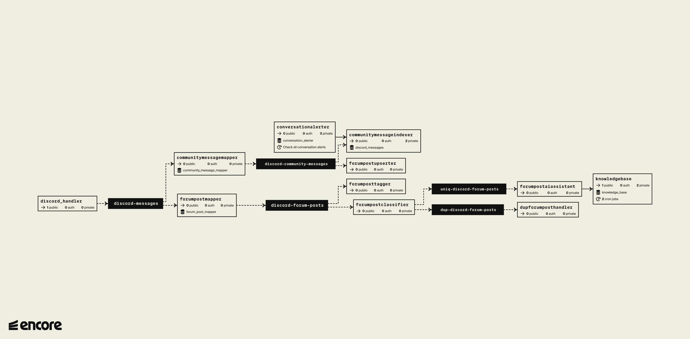

# Encore Discord Bot

This is my project for the [Encore launch week hackathon](https://encore.dev/launchweek).

It is a discord bot, aiming to help tech companies better manage their Discord community.

For the purposes of the hackathon, it is fine-tuned to help manage Encore's discord community.

Here's the main features it supports:
 * Tracks the community channel where members are chatting and identifies questions, which are related to the Encore product. It then creates forum posts based on them.
 * Forum posts are automatically categorized based on the post contents and the available Discord tags configured in the forum.
 * Maintains an index of unique forum posts and detects if a given newly created forum post is a duplicate of an older post. If so, a link to the duplicate post is sent.
 * For the unique forum posts, an AI agent answers the question by the community member using Encore's documentation as knowledge base.
 * You can configure conversation alerts - an automated alert in a moderator-only channel when a given topic or keyword is mentioned in the community channel.

## Application Architecture

## Technologies
To make this work, I'm using Encore as the framework for developing and deploying the Go application. 

There's also a very thin JavaScript application deployed on Render, which proxies all discord webhooks to the Encore application. 
This is a workaround due to an issue I stumbled upon with Discord's Go SDK which couldn't properly verify discord requests and hence, process any webhooks.

I'm also using a bunch of ChatGPT models for processing the various AI requests I'm making throughout the app:
 * chatgpt-3.5-turbo for simpler queries related to ie tagging forum posts, classifying a message as a question, etc
 * chatgpt-4-turbo for the more complex query of answering a user's question using Encore's docs as knowledge base.
 * text-embedding-3-large for generating an embedding of forum posts and Encore doc pages for storage in a vector database. 
   * Those are then used to perform similarity search based on a message's contents.

I'm leveraging [Pinecone](https://www.pinecone.io/) as a vector database for storing two indices - one for unique forum posts and one for Encore's knowledge base. 
I chose it mainly due to its good developer experience, making it an ideal hackathon choice.

Finally, I'm using [Apify](https://apify.com) and its [Website Content Crawler](https://apify.com/apify/website-content-crawler) for easily scraping the text from Encore's docs and stripping away any unnecessary elements, ie html/js/css/etc.
